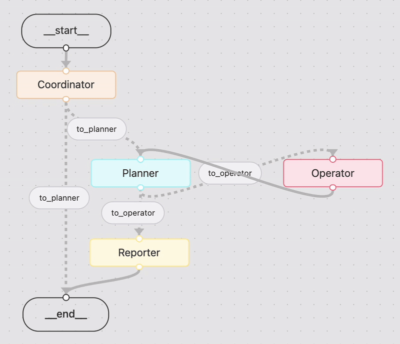

# Bedrock Manus

이 프로젝트는 [Bedrock-Manus: AI Automation Framework Based on Amazon Bedrock](https://github.com/aws-samples/aws-ai-ml-workshop-kr/tree/master/genai/aws-gen-ai-kr/20_applications/08_bedrock_manus)의 MCP 버전입니다. 이 프로젝트는 [LangManus](https://github.com/Darwin-lfl/langmanus)를 참조하고 있습니다.

## LangBuilder를 이용해 Workflow 구현

여기에서는 LangBuilder를 이용해 Base Workflow를 정의합니다. [LangBuilder를](https://build.langchain.com/)에 접속하여 아래와 같이 workflow를 그리고 code generator를 이용해 다운로드합니다. 세부 내용은 [LangGraph Builder로 Agent 개발하기](https://github.com/kyopark2014/langgraph-builder)을 참조합니다.

